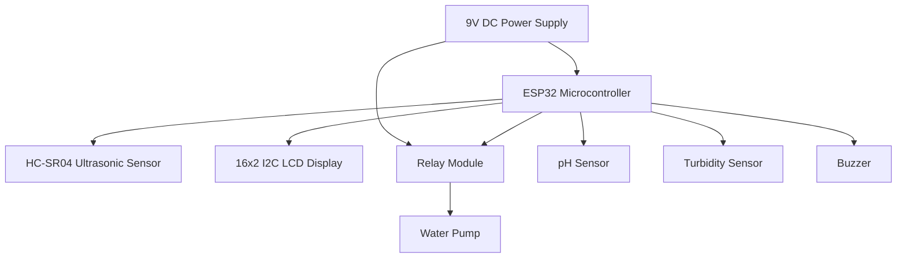

# AquaMonitor Schematic Diagrams

This document outlines the wiring and connection logic for the AquaMonitor system.

## Block Diagram



## Connection Table

| Component | ESP32 Pin | Logic Level | Description |
| :--- | :--- | :--- | :--- |
| **HC-SR04 Trigger** | GPIO 5 | 3.3V / 5V (Level Shifted) | Distance measurement trigger |
| **HC-SR04 Echo** | GPIO 18 | 3.3V (Resistor Divider) | Echo response from sensor |
| **LCD SDA** | GPIO 21 | 3.3V | I2C Data line |
| **LCD SCL** | GPIO 22 | 3.3V | I2C Clock line |
| **Relay IN** | GPIO 19 | 3.3V | Pump control (Active Low) |
| **pH Sensor** | GPIO 34 | Analog (ADC) | Water quality analysis |
| **Turbidity Sensor**| GPIO 35 | Analog (ADC) | Water clarity analysis |
| **Buzzer** | GPIO 13 | 3.3V | Alert signal |

## Logic Schematic Overview
The system is powered by a central **ESP32** module. 

1. **Level Detection**: The HC-SR04 sensor measures the time of flight for ultrasonic waves to bounce off the water surface. This is converted to distance and then to percentage fullness.
2. **Quality Monitoring**: Analog sensors (pH and Turbidity) are sampled by the ESP32's ADC pins.
3. **Control Output**: The relay acts as an electronic switch. When the ESP32 sends a signal to GPIO 19, the relay completes the circuit for the AC or DC water pump.
4. **User Feedback**: The I2C LCD provides local feedback, while the ESP32's built-in Wi-Fi sends data to the cloud.

---
*Note: Ensure common ground (GND) across all modules for stable operation.*
```
